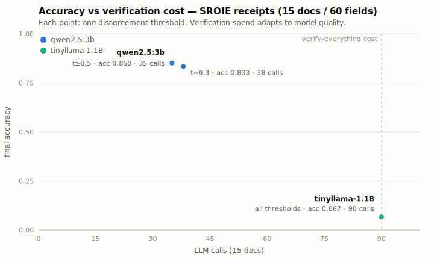

# FieldGuard

**Black-box field-level corruption detection for selective re-verification in structured LLM extraction.**

## Problem

Constrained decoding (JSON mode, schema enforcement) guarantees *structure*, not *truth*.
A forced-valid `{"price": 45}` passes every schema check while the document says `54`.
Existing benchmarks (JSONSchemaBench, ExtractBench) score schema coverage or aggregate
accuracy; existing mitigations (two-stage generation, multi-model verification)
re-process *everything*, blindly and expensively.

## Mechanism

For each document, FieldGuard extracts **twice**:

1. **Constrained path** — schema-forced JSON output.
2. **Unconstrained path** — free-form field/value answers.

Fields where the two paths **disagree** (after type-aware normalization) are flagged as
likely constraint-corrupted, and **only those fields** are re-verified with a targeted
single-field query. Result: recover most of the lost accuracy at a fraction of the
verification cost. Pure black-box — no logits, no fine-tuning, bolts onto any stack.

## Quickstart

```bash
python3 -m examples.demo          # offline demo (mock backend, synthetic invoices)
python3 -m pytest tests/ -q      # test suite
```

Real LLM backend (any OpenAI-compatible endpoint):

```python
from fieldguard.backends import OpenAICompatBackend
backend = OpenAICompatBackend(base_url="http://localhost:11434/v1", model="llama3.1")
```

## Package layout

| Module | Role |
|---|---|
| `fieldguard/schemas.py` | Field/schema specs + JSON Schema export |
| `fieldguard/backends.py` | LLM backend protocol, mock (offline/tests), OpenAI-compatible |
| `fieldguard/extract.py` | Dual-path extraction (constrained + unconstrained) |
| `fieldguard/compare.py` | **Core**: type-aware normalization + per-field disagreement |
| `fieldguard/verify.py` | Selective re-verification of flagged fields |
| `fieldguard/metrics.py` | Corruption rate, flag precision/recall, cost accounting |
| `fieldguard/data.py` | Synthetic gold dataset (offline development) |
| `fieldguard/pipeline.py` | End-to-end orchestration |
| `fieldguard/calibrate.py` | Threshold sweep: accuracy vs verification-cost curve |
| `fieldguard/adapter.py` | JSONL loader for external datasets, schema inference |

## Real benchmark: SROIE receipts (ICDAR 2019, 50 docs / 200 fields)

Real scanned-receipt OCR text, gold company/date/address/total.
Convert once with `python3 -m examples.convert_sroie`, run with
`python3 -m examples.experiment --data datasets/sroie_50.jsonl --model <m> --n 50`.

| | qwen2.5:3b | tinyllama-1.1B |
|---|---|---|
| constrained accuracy | 0.815 | 0.005 |
| final accuracy | 0.830 | 0.075 |
| flag precision / recall | 0.800 / 0.953 | 0.070 / 1.0 |
| low-confidence self-report | 5/200 | 199/200 |
| LLM calls vs verify-everything | **-61%** | 0% (all flagged) |

Gold-noise ceiling ≈ 0.92 (SROIE gold sometimes disagrees with its own OCR text;
see BUILDLOG iteration 7). The adaptive-cost finding replicates on real data.



Regenerate: `python3 -m examples.sweep --data datasets/sroie_15.jsonl --model <m> --n 15
--thresholds 0.3,0.5,0.6,0.75,0.9` then `python3 -m examples.figure`.

## First real-model results (local Ollama, 8 prose invoices / 40 fields)

| | qwen2.5:3b | tinyllama-1.1B |
|---|---|---|
| constrained accuracy | 1.000 | 0.000 |
| final accuracy | 1.000 | 0.400 |
| flag precision / recall | 0.875 / 1.0 | 0.938 / 1.0 |
| low-confidence self-report | 0/40 | 37/40 |
| LLM calls vs verify-everything | **-70%** | 0% (all flagged) |

Verification spend adapts to model quality: near-zero overhead on a capable
model, full spend plus loud self-reporting on a broken one. Known limitation
(documented in `docs/BUILDLOG.md`): identical correlated errors across both
paths are invisible to disagreement by construction; the empty-field case is
auto-flagged.

**Scope delineation (OCR-noise experiment):** with smudged source text the model
misreads both paths identically — accuracy drops, zero flags fire. The dual-path
signal detects *constraint-induced* corruption specifically; *source-induced*
corruption needs a different signal. Full findings: `docs/BUILDLOG.md` iteration 6.

See `docs/ARCHITECTURE.md` for the full design and `docs/BUILDLOG.md` for the
build-test-fix-document history.
