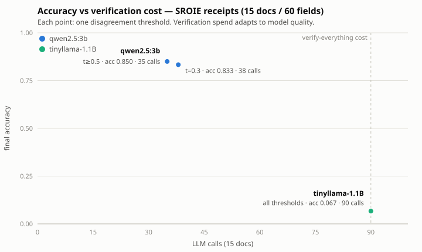
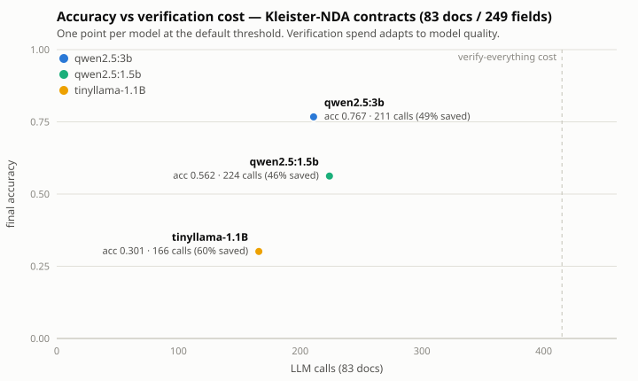
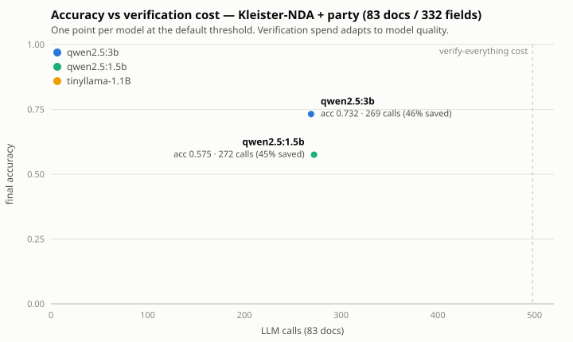

# FieldGuard

**Black-box field-level corruption detection for selective re-verification in structured LLM extraction.**

## Problem

Constrained decoding (JSON mode, schema enforcement) guarantees *structure*, not *truth*.
A forced-valid `{"price": 45}` passes every schema check while the document says `54`.
Existing benchmarks (JSONSchemaBench, ExtractBench) score schema coverage or aggregate
accuracy; existing mitigations (two-stage generation, multi-model verification)
re-process *everything*, blindly and expensively.

## Mechanism

For each document, FieldGuard extracts **twice**:

1. **Constrained path** — schema-forced JSON output.
2. **Unconstrained path** — free-form field/value answers.

Fields where the two paths **disagree** (after type-aware normalization) are flagged as
likely constraint-corrupted, and **only those fields** are re-verified with a targeted
single-field query. Result: recover most of the lost accuracy at a fraction of the
verification cost. Pure black-box — no logits, no fine-tuning, bolts onto any stack.

## Live app (real model, real time)

```bash
python3 -m fieldguard.server            # http://localhost:8000
```

Paste a document (or pick one of the shipped SROIE / Kleister samples with its
gold labels), pick a local model, hit Run. The page then streams **one frame per
pipeline stage as it happens** over Server-Sent Events — the two extraction
prompts and their raw responses, the canonical forms actually compared, the
per-field disagreement scores, each blind arbiter call as it lands, the
source-support bars, and finally the record FieldGuard ships **next to the record
plain JSON mode would have shipped**, scored against gold.

Every stage states what it is for and what would go wrong without it, so the
mechanism is legible to someone watching for the first time. Nothing is
pre-computed: `fieldguard/live.py` runs the same primitives as the batch
pipeline, and a test (`tests/test_live.py`) pins the streamed result to be
byte-identical to `pipeline.run` on the same input — the demo cannot drift into
theatre.

```bash
python3 -m fieldguard.server --model qwen2.5:1.5b --port 8080
python3 -m fieldguard.server --base-url https://api.openai.com/v1 --model gpt-4o-mini
```

Pick the `mock` model to drive the page with no LLM at all (offline).

## Results dashboard

`docs/dashboard.html` is a self-contained inspector (no server, no deps) built
from the stored runs — open it in a browser. Static by design: it is a *viewer*
over completed benchmark runs, the counterpart to the live app above.

An **8-stage pipeline** is the spine of the page, and it is driven by whichever
field you click, showing that field's real value at every stage:

```
01 SOURCE → 02 CONSTRAINED ┐                    ┌ 06 ARBITER ┐
                           ├ 04 NORMALIZE → 05 DISAGREE ─────┼ 07 GROUND → 08 KEPT
           03 FREE-FORM ───┘                    └ (skipped)  ┘
                                          signal 1      signal 2
```

Stage 06 renders dimmed and struck through whenever a field was not flagged —
the cost saving shown rather than asserted. Stage 04 prints the actual canonical
forms, so you can watch `2018-12-25` and `25/12/2018` collapse into one string.
Field values are laid out as aligned columns (constrained │ free-form │ kept │
gold) so a discrepancy is caught by scanning across.

```bash
python3 -m examples.build_dashboard   # regenerate from results/
```

## Every number here is on a public benchmark

Results are measured on **SROIE** (ICDAR 2019 Task 3, 50 receipts) and
**Kleister-NDA** (Stanisławek et al. 2021, the full 83-document **dev-0**
split — the largest split whose gold labels are public). No sampling, no
cherry-picking; the one synthetic corpus in this repo is labelled a smoke test
and appears in no results table.

Verify rather than trust — this downloads the official releases, re-derives
our files with the shipped converters, and compares byte-for-byte:

```bash
python3 -m examples.verify_datasets
```

Provenance, splits, licensing, checksums and a metric→dataset map:
[docs/DATA.md](docs/DATA.md).

## Two signals

| signal | catches | blind to |
|---|---|---|
| **dual-path disagreement** (`compare.py`) | corruption the *constraint* caused — the paths differ | anything both paths get wrong identically |
| **source grounding** (`ground.py`) | *fabrication* — a value the document never states, however confidently both paths agree | values misread from a corrupted source (they are present in it) |

Confirmed live end-to-end on Kleister qwen2.5:1.5b (n=83): final accuracy
**0.562 → 0.655 (+9.2 pts)** at **224 → 224 LLM calls** — the repair replaces a
value rather than querying for one, so it is free. Extraction was bit-identical
to the baseline run, isolating the delta to the rule.

Grounding is the newer, orthogonal signal. It is training-free like the first
one, and it directly attacks the correlated blind spot the first one cannot see.
Measured on clean text (post encoding repair, see below), per cell:

| cell | errors caught | precision | repair effect (fixed/broken) |
|---|---|---|---|
| Kleister 1.5b | 30/109 (28%) | 0.97 | **+9.2 pts** (24/1) |
| Kleister 3b | 7/58 (12%) | 1.00 | +2.8 pts (7/0) |
| Kleister+party 1.5b | 31/144 (22%) | 0.97 | +6.9 pts (24/1) |
| Kleister+party 3b | 6/92 (7%) | 1.00 | +1.8 pts (6/0) |
| SROIE (both qwen) | 0–5 | 1.00 | ±0.0 (no-op) |

On clean text the repair helped **every** cell it fired in and broke at most
one field. That single break is the same document in both cells, and there the
gold value is absent from the (truncated) source: the model produced it with
no evidence in its input and happened to match gold, so the grounding call was
correct about what it was given. The rule blanked **zero** document-supported
values.

An earlier draft reported the repair harming the capable model (−0.9). That
harm was an artifact of the corrupted Kleister encoding — the false alarms
were values split by fake `\n` tokens — and it disappeared with the repair of
the data. The rule stays opt-in (`--ground-repair`) with the gold-free
`ungrounded_rate` as the expected-gain signal: 12.4% on the fabricating cell
vs 0–2.8% on reliable ones (the party 1.5b cell reads 9.6% — the boundary is
not sharp, and the band edges are observed, not tuned).

## Unified confidence (selective prediction)

Each field also gets one confidence score: resolution band (agreement >
corroborated majority > uncorroborated split) × source support — fixed
constants, nothing fitted, ranking-only claim. `python3 -m
examples.risk_coverage` measures it with risk–coverage curves/AURC against
flag-only, support-only and random baselines from stored traces (zero LLM
calls). A ground-repaired field keeps its low pre-repair support, so repair
cannot launder a fabrication into high confidence.

AURC, all six cells (lower = errors ranked later; random = the error rate):

| cell | random | flag-only | support-only | **combined** |
|---|---|---|---|---|
| SROIE 3b | 0.145 | 0.123 | 0.141 | **0.114** |
| SROIE 1.5b | 0.270 | 0.203 | 0.245 | **0.191** |
| Kleister 3b | 0.233 | 0.143 | 0.187 | **0.141** |
| Kleister 1.5b | 0.438 | 0.299 | 0.262 | **0.221** |
| Kleister+party 3b | 0.277 | 0.174 | 0.248 | **0.146** |
| Kleister+party 1.5b | 0.434 | 0.290 | 0.320 | **0.243** |

The combined score wins **6/6** — and neither single signal does: flag-only
nearly ties on capable models, support-only wins on the fabricating one; the
combination is best everywhere.

## Quickstart

```bash
python3 -m examples.demo          # offline demo (mock backend, synthetic invoices)
python3 -m pytest tests/ -q      # test suite
```

Real LLM backend (any OpenAI-compatible endpoint):

```python
from fieldguard.backends import OpenAICompatBackend
backend = OpenAICompatBackend(base_url="http://localhost:11434/v1", model="llama3.1")
```

## Package layout

| Module | Role |
|---|---|
| `fieldguard/schemas.py` | Field/schema specs + JSON Schema export |
| `fieldguard/backends.py` | LLM backend protocol, mock (offline/tests), OpenAI-compatible |
| `fieldguard/extract.py` | Dual-path extraction (constrained + unconstrained) |
| `fieldguard/compare.py` | **Core**: type-aware normalization + per-field disagreement |
| `fieldguard/verify.py` | Selective re-verification of flagged fields |
| `fieldguard/metrics.py` | Corruption rate, flag precision/recall, cost accounting |
| `fieldguard/data.py` | Synthetic gold dataset (offline development) |
| `fieldguard/pipeline.py` | End-to-end orchestration |
| `fieldguard/calibrate.py` | Threshold sweep: accuracy vs verification-cost curve |
| `fieldguard/adapter.py` | JSONL loader for external datasets, schema inference |
| `fieldguard/ground.py` | Second signal: is the kept value supported by the source? |
| `fieldguard/live.py` | Instrumented single-document run — yields one event per stage |
| `fieldguard/server.py` | Stdlib HTTP server streaming those events to `web/live.html` |

## Real benchmark: SROIE receipts (ICDAR 2019, 50 docs / 200 fields)

Real scanned-receipt OCR text, gold company/date/address/total.
Convert once with `python3 -m examples.convert_sroie`, run with
`python3 -m examples.experiment --data datasets/sroie_50.jsonl
--schema datasets/sroie.schema.json --model <m> --n 50`.

| | qwen2.5:3b | qwen2.5:1.5b | tinyllama-1.1B |
|---|---|---|---|
| constrained accuracy | 0.820 | 0.715 | 0.005 |
| final accuracy | 0.855 | 0.730 | 0.005 |
| flag precision / recall | 0.780 / 0.950 | 0.690 / 0.970 | 0.085 / 1.0 |
| low-confidence self-report | 5/200 | 17/200 | 200/200 |
| LLM calls vs verify-everything | **-61%** | **-56%** | 0% (all flagged) |

95% doc-bootstrap CIs (`python3 -m examples.analyze`): 3b [0.810, 0.900],
1.5b [0.680, 0.780] (disjoint — the model separation is real), tinyllama
[0.000, 0.015].

All columns use `datasets/sroie.schema.json` field descriptions — one sentence
per field buys the capable model +3 points final accuracy at identical cost
(company errors 13→8; BUILDLOG iteration 11); the broken model is unmoved.
**Verification spend tracks model quality monotonically** — the knob nobody
has to tune: 61% → 56% → 0% saved as the extractor degrades.

Gold-noise ceiling ≈ 0.92 (SROIE gold sometimes disagrees with its own OCR text;
see BUILDLOG iteration 7). The adaptive-cost finding replicates on real data.



## Second domain: Kleister-NDA contracts (83 docs / 249 fields, 30% absent)

Real NDA contracts (long documents — the converter keeps head + tail + keyword
windows around the governing-law/term clauses to fit a 4k local context).
Fields: effective_date, jurisdiction, term — all marked **optional** in the
schema (75/249 gold fields are legitimately absent; the extractor must answer
"not stated", which only the arbiter is allowed to phrase as NONE).

| | qwen2.5:3b | qwen2.5:1.5b | tinyllama-1.1B |
|---|---|---|---|
| constrained accuracy | 0.775 | 0.546 | 0.301* |
| final accuracy | 0.767 | 0.562 | 0.301* |
| + grounding repair (free) | **0.795** | **0.655** | — |
| flag precision / recall | 0.657 / 1.0 | 0.514 / 0.976 | 1.0 / 1.0* |
| absent fields answered absent | 49/75 | 3/75 | 75/75* |
| LLM calls vs verify-everything | **-49%** | **-46%** | -60%* |

95% CIs (doc bootstrap): 3b [0.719, 0.815] vs 1.5b [0.502, 0.622] — disjoint;
the model separation is established in this domain too. (All Kleister numbers
are post encoding repair — the source TSV escapes newlines as literal `\n`
and the first converter fed them through; see BUILDLOG 36.)

*tinyllama answers absent for **all 249 fields** — its 0.301 is exactly the
gold-absence share, and both-paths-absent counts as agreement, so **zero
flags fire** (166 calls = exactly the two extractions per document; the 1.0
flag P/R is the vacuous no-flags/no-corruption default, not skill).
`examples/analyze.py` prints a `[!] N/N answers absent` tripwire for this; on
all-optional schemas keep at least one required field or watch that tripwire
— the empty-field auto-flag no longer guards you.



(tinyllama's point is the all-absent artifact described above — high "savings"
because agreement-on-absence never flags.)

### With the multi-valued `party` field (4 fields / 332)

`party` is set-valued (1–3 parties per contract; exact-set match after
normalization, incl. corporate-suffix equivalence Incorporated≡Inc, L.L.C.≡LLC):

| | qwen2.5:3b | qwen2.5:1.5b |
|---|---|---|
| constrained → final accuracy | 0.723 → 0.723 | 0.551 → 0.566 |
| + grounding repair (free) | **0.741** | **0.636** |
| party exact-set correct | 60/83 | 52/83 |
| LLM calls vs verify-everything | **-45%** | **-44%** |
| 95% CI (final) | [0.678, 0.765] | [0.518, 0.611] |

Run: `python3 -m examples.experiment --data datasets/kleister_nda_party.jsonl
--schema datasets/kleister_nda_party.schema.json --model <m> --n 83`.

**Reported flag precision is a lower bound.** "Corrupted" counts only fields the
constraint itself damaged (constrained wrong *and* unconstrained right); a field
wrong on both paths is still flagged and reported low-confidence but scores as a
false positive — most of why party precision reads 0.31–0.33.

Two absence lessons (BUILDLOG iteration 21): (1) an "answer NONE if absent"
instruction in the shared prompt made both paths lazily deny values that ARE
in the document — instructions that correlate the paths break the
disagreement signal (same failure family as the reverted judge arbiter);
absence must be expressed structurally. (2) Absence detection is a
capability: 3b answers 49/75 absent fields correctly, 1.5b hallucinates a
value for 72/75 — identically on both paths, the documented correlated
blind spot (which is exactly where grounding repair earns its +9.2).

Same adaptive-cost shape in a second domain. Contracts pushed three fixes into
the method: clause-window truncation, number-word/legalese-date normalization,
and the split-kept resolution rule (an uncorroborated flag keeps the
constrained value instead of trusting a lone arbiter answer — arbiter-wins was
measurably damaging accuracy; BUILDLOG iteration 17).



Regenerate: `python3 -m examples.sweep --data datasets/sroie_15.jsonl --model <m> --n 15
--thresholds 0.3,0.5,0.6,0.75,0.9` then `python3 -m examples.figure`.

## Smoke test, NOT a result (local Ollama, 8 synthetic prose invoices / 40 fields)

> **Read the 1.000 as "this set is saturated", not as "the method is perfect."**
> These 8 documents are synthetic and were written by this repo (`data.py`) with
> the values stated in clean prose. qwen2.5:3b reads all 40 fields correctly
> under constraint, so `corruption_rate` is **0.000** — there was nothing for
> FieldGuard to repair, and 1.000 → 1.000 measures the *dataset*, not the
> mechanism. A benchmark with no headroom cannot separate methods. Cite SROIE
> and Kleister-NDA above; this cell exists to prove the code runs end-to-end
> against a real model and that a broken extractor still gets caught.

| | qwen2.5:3b | tinyllama-1.1B |
|---|---|---|
| constrained accuracy | 1.000 *(saturated)* | 0.000 |
| final accuracy | 1.000 *(saturated)* | 0.400 |
| constraint-corrupted fields available to repair | **0/40** | 6/40 |
| flag precision / recall | 0.875 / 1.0 | 0.938 / 1.0 |
| low-confidence self-report | 0/40 | 37/40 |
| LLM calls vs verify-everything | -70% | 0% (all flagged) |

(The same caveat applies to `python3 -m examples.demo`, whose 1.000 is true *by
construction*: `MockBackend` is a perfect reader and the corruptions are the
ones this repo injects. It is a smoke test for the wiring, not evidence.)

The one thing this cell does show is that verification spend adapts to model
quality: near-zero overhead on a capable model, full spend plus loud
self-reporting on a broken one. Known limitation
(documented in `docs/BUILDLOG.md`): identical correlated errors across both
paths are invisible to disagreement by construction; the empty-field case is
auto-flagged.

**Scope delineation (OCR-noise experiment):** with smudged source text the model
misreads both paths identically — accuracy drops, zero flags fire. The dual-path
signal detects *constraint-induced* corruption specifically; *source-induced*
corruption needs a different signal. Full findings: `docs/BUILDLOG.md` iteration 6.

See `docs/ARCHITECTURE.md` for the full design and `docs/BUILDLOG.md` for the
build-test-fix-document history.
